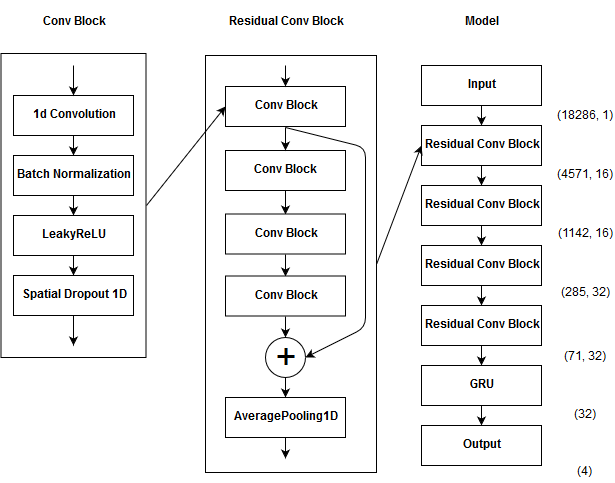

# Solving physionet2017 with RCRNN 

# About
This is sollution for solving Physionet 2017 Challenge by Residual Convolution Recurrent Neural Network with 0.86 accuracy and 0.83 F1 score.

## Physionet 2017
The task of competition is the classification of ECG records into 4 classes (normal, abnormal, other, noisy), the quality of classification was measured as an average F1 of three classes (N, A, O).

[You can read more here.](https://physionet.org/challenge/2017/)

## Model
This model combines residual convolution and recurrent layers.

## Results
[Top1 result](http://www.cinc.org/archives/2017/pdf/173-154.pdf) achived 0.83 F1 score on test set (still not published) and 0.91, 0.79 and 0.77 F1 scores on 5 fold cross-validation.

This solution achived 0.92, 0.8, 0.78 on same cross-validation which is slightly higher and at least comparable to the first place.

## Code
[Google Colab Notebook.](https://colab.research.google.com/drive/1E5xUSKuU9QjGnZUaWvtTHXgFlaYybVSL)

## Acknowledgments
[Gihub repo with nice description of competition and it's data.](https://github.com/awerdich/physionet)
